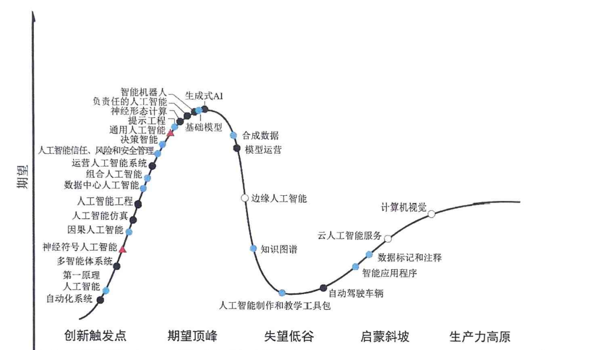

这部分内容详细介绍了人工智能领域中不同类型的代理（Agent）。以下是对这部分内容的详细解释：

1. **符号 Agent**：
   - 在人工智能研究的早期阶段，占主导地位的方法是符号人工智能，这种方法采用逻辑规则和符号表示来封装知识并促进推理过程。
   - 这些Agent拥有显式和可解释的推理框架，基于符号性质，它们展现出高程度的表达能力。
   - 使用这种方法的经典例子是基于知识工程构建的专家系统。
   - 然而，众所周知，虽然符号Agent的表达能力非常强，但无法解决超出它的知识库记录的任何问题。
   - 因此，它们在处理不确定性和大规模现实世界问题时有局限，而且当知识库增加时，它们对计算资源的消耗也会增加。

2. **反应型 Agent**：
   - 与符号Agent不同，反应型Agent不使用复杂的符号推理框架，也不因其符号性质而表现出高程度的表达能力。
   - 相反，它们主要侧重于Agent与环境之间的互动，强调快速和实时的响应。
   - 这些Agent主要基于感知-动作环，高效地感知环境，并做出反应。
   - 然而，反应型Agent也存在局限性。它们通常需要较少的计算资源，能够更快地响应，但缺乏复杂的高级决策制定和规划的能力。

3. **基于强化学习的 Agent**：
   - 随着计算能力和数据可用性的提高，以及对Agent与其环境之间相互作用模拟的兴趣日益高涨，研究人员开始利用强化学习方法训练Agent。
   - 强化学习领域的主要问题是如何使Agent通过与环境的互动来学习，以实现特定任务中的最大累积回报。
   - 早期基于强化学习的Agent主要基于策略搜索和价值函数优化等基本技术，如Q-Learning和SARSA。
   - 随着深度学习的崛起，深度神经网络与强化学习的结合，即深度强化学习，使Agent能够从高维输入中学习复杂策略。
   - 这种方法的优势在于它能够使Agent自主地在未知环境中学习，无须显式人为干预，这为其在游戏、机器控制等领域中的广泛应用提供了可能。
   - 尽管如此，在复杂的现实世界中，强化学习仍面临训练时间长、样本效率低和稳定性差等诸多挑战。

4. **具有迁移学习和元学习能力的 Agent**：
   - 为了解决基于强化学习的Agent在新任务上的学习要求大量的样本和长时间的训练，并且缺乏泛化能力的问题，研究人员引入了迁移学习来减轻新任务训练的负担，促进跨不同任务的知识共享和迁移，从而提高学习效率和泛化能力。
   - 元学习专注于如何学习，能够迅速推断出针对新任务的最佳策略。
   - 这种Agent在面对新任务时，能够迅速调整学习策略，利用已有的知识和策略，因此能够减少对大量样本的依赖。
   - 然而，显著的样本差异可能会削弱迁移学习的效果。此外，大量的预训练和对大量样本的需求可能使得元学习难以建立一个通用的学习策略。

总之，这部分内容详尽地介绍了符号Agent、反应型Agent、基于强化学习的Agent以及具有迁移学习和元学习能力的Agent的工作原理、优势和局限性。

---

### 符号Agent详细解释及举例

**符号Agent**是在人工智能研究早期广泛使用的一种方法，它依赖于逻辑规则和符号表示来获取和处理知识。这种方法类似于我们人类使用语言和数学公式来理解和解决问题。

#### 详细解释：
1. **逻辑规则和符号表示**：
   - 符号Agent使用一系列“如果...那么...”的规则来进行推理。例如，“如果天空是蓝色的，那么它很可能是晴天。”
   - 这些规则和符号的使用使得推理过程非常明确和可解释，每一步推理都是基于已知的规则进行的。

2. **推理过程**：
   - 符号Agent的推理过程是基于已定义的逻辑规则进行的。这些规则被存储在知识库中，Agent根据输入的信息进行匹配和推理。
   - 例如，给定一组症状，医疗诊断系统可以通过逻辑推理，逐步缩小可能的疾病范围。

3. **优势**：
   - 符号Agent的最大优势在于其透明性和可解释性。每一步推理都是基于明确的规则进行的，因此可以很容易地解释和验证。
   - 符号Agent在处理结构化和规则明确的问题时非常有效。

4. **局限性**：
   - 符号Agent在处理不确定性和复杂的现实世界问题时表现不佳，因为这些问题通常难以通过简单的规则进行描述和解决。
   - 随着知识库的扩展，符号Agent对计算资源的需求也会大幅增加。

#### 举例：
**专家系统（Expert System）**：
- **背景**：专家系统是符号Agent的一种经典应用，它被广泛用于医疗、法律等需要专业知识的领域。
- **工作原理**：
  - 专家系统包含一个知识库，存储着大量的规则和事实。例如，关于某种疾病的症状及其可能的诊断结果。
  - 当用户输入一些症状时，系统会根据知识库中的规则进行推理。例如：
    - 规则1：“如果患者有发烧和咳嗽，那么可能是感冒。”
    - 规则2：“如果患者有发烧、咳嗽和胸痛，那么可能是肺炎。”
  - 系统会逐条检查这些规则，寻找与输入症状匹配的规则，然后给出一个或多个可能的诊断结果。
- **示例**：
  - 医生输入：“患者有发烧、咳嗽和呼吸困难。”
  - 系统分析：
    - 规则1不完全匹配，因为缺少“呼吸困难”症状。
    - 规则2部分匹配，但“呼吸困难”更符合“肺炎”的症状。
  - 系统输出：“可能的诊断结果：肺炎。”

通过这种方式，符号Agent能够在特定领域内非常有效地工作。然而，随着现实世界问题的复杂性增加，这种基于固定规则的系统会变得越来越不灵活。因此，符号Agent在处理动态和不确定性问题时表现出明显的局限性。

---

### 反应型Agent详细解释及举例

**反应型Agent**（Reactive Agent）是一种无需复杂的逻辑推理框架，而是直接基于环境的输入做出快速反应的代理。这种Agent不依赖于内部模型或符号表示，而是通过感知-动作对（perception-action pair）来实现行为反应。

#### 详细解释：
1. **基本原理**：
   - 反应型Agent通过感知环境中的变化并立即采取行动，没有复杂的推理或决策过程。
   - 这种方式类似于我们身体的反射动作，例如，当我们手碰到热物体时会立即缩回，而无需经过复杂的思考。

2. **感知-动作对**：
   - 反应型Agent的核心是感知-动作对，这是一种简单的规则：当感知到某种情况时，立即采取特定的行动。
   - 例如，“如果感知到障碍物在前方，那么转向左侧。”

3. **优点**：
   - 反应速度快，因为不需要复杂的计算或推理。
   - 计算资源需求少，适合实时系统。

4. **局限性**：
   - 缺乏全局视野和复杂决策能力，不能处理需要长期规划或高级推理的问题。
   - 行为是预先定义的，缺乏灵活性。

#### 举例：
**自动避障机器人**：
- **背景**：假设我们有一个简单的机器人，其任务是在房间内自由移动，同时避免撞到障碍物。
- **工作原理**：
  - 机器人配备了距离传感器，可以感知周围的障碍物。
  - 它的行为规则非常简单：当距离传感器检测到前方有障碍物时，机器人会立即转向另一方向。
- **具体示例**：
  - **感知**：机器人向前移动时，前方传感器检测到距离前方障碍物只有10厘米。
  - **动作**：根据预先设定的规则，“如果前方距离小于20厘米，那么左转。”
  - **执行**：机器人立即向左转，继续移动。
- **过程**：
  - 机器人不断感知周围环境，当检测到障碍物时，根据感知-动作对规则，迅速做出反应。
  - 这种反应是即时的，没有复杂的计算，确保了机器人能够在动态环境中快速调整方向，避免碰撞。

通过这种方式，反应型Agent能够在实时环境中有效工作，尤其适用于需要快速响应的场景。然而，由于其缺乏复杂的推理和决策能力，反应型Agent在面对需要长期规划或多步骤决策的问题时会显得不足。

---

### 基于强化学习的Agent详细解释及举例

**基于强化学习的Agent**是一种通过与环境的互动来学习最优行为策略的代理。这种方法强调通过试验和错误来获得奖励，从而逐步改进行为策略，以实现特定任务的最大累积回报。

#### 详细解释：
1. **基本原理**：
   - 强化学习是一种学习方法，Agent通过与环境的交互获得反馈（奖励或惩罚），以此调整和改进自己的行为策略。
   - 目标是找到一种策略，使得在给定环境中获得的总奖励最大化。

2. **关键组件**：
   - **状态（State）**：Agent在某一时刻所处的环境情况。
   - **动作（Action）**：Agent可以在特定状态下采取的行动。
   - **奖励（Reward）**：Agent采取某一行动后从环境中获得的反馈。
   - **策略（Policy）**：指导Agent在每个状态下选择哪个动作的规则或模型。
   - **值函数（Value Function）**：评估在某一状态下或采取某一动作后的预期累积奖励。

3. **学习过程**：
   - Agent通过不断试验不同的动作，观察获得的奖励，并更新其策略，使得未来在相似状态下能够选择更优的动作。
   - 经典的强化学习算法包括Q-Learning和SARSA，这些算法通过更新值函数来指导策略的改进。

4. **优点**：
   - 能够自适应地学习复杂环境中的最优策略，无需预先定义所有规则。
   - 适用于动态和不确定性较大的问题。

5. **局限性**：
   - 训练过程需要大量的时间和数据，特别是在复杂环境中。
   - 计算资源需求高，尤其是在深度强化学习中，需要大量的计算来处理高维度的数据。

#### 举例：
**自动驾驶汽车的学习过程**：
- **背景**：假设我们有一辆自动驾驶汽车，其任务是在一个模拟的城市环境中学习如何安全、高效地驾驶。
- **工作原理**：
  - 汽车的状态包括其当前位置、速度、周围车辆和行人等信息。
  - 它的动作包括加速、减速、转向等。
  - 奖励函数设定为汽车在不发生碰撞的情况下成功到达目的地时获得高分，发生碰撞或违规时扣分。
- **具体示例**：
  - **状态**：汽车在十字路口，前方有行人通过。
  - **动作**：汽车可以选择“停车”等待或“继续行驶”。
  - **奖励**：
    - 选择“停车”，安全通过十字路口，获得正奖励。
    - 选择“继续行驶”，发生碰撞，获得负奖励。
- **过程**：
  - 在训练初期，汽车可能会因为缺乏经验而做出错误的决策，如在不适当的时候继续行驶，导致碰撞。
  - 随着更多的训练，汽车会逐渐学会在有行人时停车，通过累积经验和调整策略，减少碰撞并增加成功通过十字路口的次数。
  - 最终，汽车能够在各种复杂的交通状况下做出最优决策，实现安全驾驶。

通过这种方式，基于强化学习的Agent能够通过不断试验和学习，逐步改进其行为策略，适应复杂和动态的环境。然而，这种学习过程通常需要大量的时间和数据来实现有效的策略改进。

---

### 具有迁移学习和元学习能力的Agent详细解释及举例

**具有迁移学习和元学习能力的Agent**是一类先进的智能代理，它们不仅可以从当前任务中学习，还能将学到的知识应用于新任务，甚至学习如何快速适应新任务。这种方法弥补了传统强化学习在处理新任务时需要大量数据和长时间训练的缺点。

#### 详细解释：
1. **迁移学习（Transfer Learning）**：
   - **基本概念**：迁移学习通过利用在一个任务中学到的知识来帮助另一个相关任务的学习。这种方法可以显著减少新任务的训练时间和数据需求。
   - **应用场景**：例如，一个在驾驶模拟环境中训练过的自动驾驶Agent，可以利用这些经验在新的、更复杂的驾驶环境中快速适应，而不需要从零开始重新训练。

2. **元学习（Meta-Learning）**：
   - **基本概念**：元学习是关于学习如何学习的过程。它使Agent能够迅速推断出针对新任务的最佳策略，而无需大量的新数据。这种方法通常涉及训练一个模型，使其能够从少量样本中学习有效的策略。
   - **应用场景**：例如，一个图像分类系统，通过元学习可以迅速适应新的图像类别，只需少量的新样本。

3. **优点**：
   - **效率高**：能够在新任务上迅速达到较高的性能，减少训练时间和数据需求。
   - **适应性强**：能够处理多任务环境，适应性和泛化能力强。

4. **局限性**：
   - **复杂性高**：实现迁移学习和元学习的方法较复杂，通常需要高性能计算资源。
   - **任务依赖性**：迁移学习的效果可能受到任务之间相似程度的影响，差异过大时效果不佳。

#### 举例：
**多任务机器人**：
- **背景**：假设我们有一个服务机器人，它需要在不同的家庭环境中执行多种任务，如清洁地板、整理物品和为主人递送物品。
- **工作原理**：
  - **迁移学习**：机器人在一个家庭中学会了如何清洁地板，当它进入一个新的家庭环境时，可以利用之前学到的清洁技巧，而不需要重新学习所有细节。
  - **元学习**：机器人通过少量示范学习新的任务，如主人示范一次如何整理书架，机器人就能迅速掌握并执行相同的任务。
- **具体示例**：
  - **任务1：清洁地板**：
    - 在第一个家庭中，机器人通过长时间的训练学会了如何避开家具、识别污渍并进行清洁。
    - 当进入第二个家庭时，机器人利用在第一个家庭中学到的经验，迅速适应新环境的布局，立即开始高效清洁。
  - **任务2：整理书架**：
    - 主人在新环境中示范了一次如何将书籍按大小整理。
    - 机器人通过元学习，迅速理解了这一任务要求，并在接下来的整理工作中表现出色。
- **过程**：
  - 机器人在不同任务和环境中，通过迁移学习和元学习不断积累知识和经验。
  - 在新的环境中，机器人能够快速适应，利用已有的知识和策略高效完成任务，减少训练时间和数据需求。

通过这种方式，具有迁移学习和元学习能力的Agent能够在面对新任务时迅速适应和执行，高效解决问题。这种先进的学习方法使得Agent在多任务和动态环境中表现出色，具有广泛的应用前景。

---

